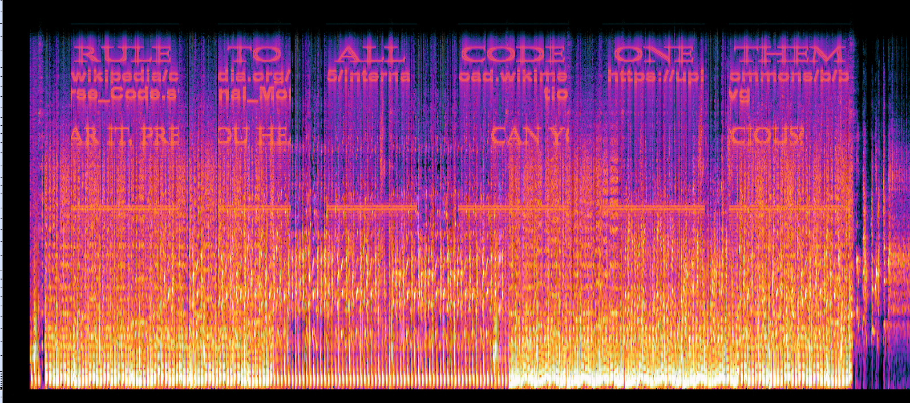
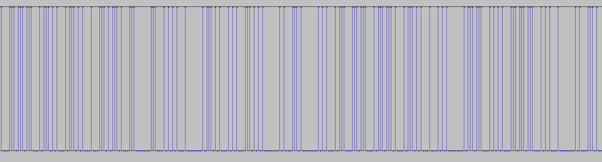

# Description
Seeing his secret weapon falter, Zer0 realizes that the tide of battle is turning against him. Within the corrupted code of the AI, R-Boy discovers an audio message hidden away—a message that can deactivate Nethra forever and defeat its creator. Only then can R-Boy obtain the final Fragment of Knowledge, the Fragment of Variability, and seal his destiny as the greatest hacker and knight of the Digital Realms.

# Write up
We get a zip file with a wav file called `listen_you_fools.wav`
```
ExifTool Version Number         : 12.65
File Name                       : listen_you_fools.wav
Directory                       : .
File Size                       : 25 MB
File Modification Date/Time     : 2023:10:10 13:50:50+01:00
File Access Date/Time           : 2023:10:14 03:03:13+01:00
File Inode Change Date/Time     : 2023:10:14 03:03:11+01:00
File Permissions                : -rwxr-xr-x
File Type                       : WAV
File Type Extension             : wav
MIME Type                       : audio/x-wav
Encoding                        : Microsoft PCM
Num Channels                    : 2
Sample Rate                     : 48000
Avg Bytes Per Sec               : 192000
Bits Per Sample                 : 16
Duration                        : 0:02:09
```

Loading it into Audacity, and opening spectrogram view we get:


Which ordered translates to:
```
One code to rule them all
https://upload.wikimedia.org/wikipedia/commons/b/b5/International_Morse_Code.svg
```

The wikimedia International Morse Code page mentions
1. The length of a dot is one unit.
2. A dash is three units.
3. The space between parts of the same letter is one unit.
4. The space between letters is three units.
5. The space between words is seven units.

So we take this as rule at this point.

Looking closer at the beginning of the wav file we notice some harsh noise that appears to have some strange patterns:


This seems to match the morse code patterns above, with blocks of 3 and 7 units, so we interpreted it as morse code based on this. Loading the wav file into python and analyzing each channel independently:

```
def read_morse(ch):
    data, sampler = sf.read('listen_you_fools.wav',start=0,stop=1280)
    data = data[:,ch]
    m = ""
    for i in data:
        if i <= 4e-5:
            m += "0"
        else:
            m += "1"
    print(reps(m))

read_morse(0)
read_morse(1)
```

```
/-.-. --- .-.. .-.. . -.-. -/- .... ./.-.. ... -.../.. -./... .- -- .--. .-.. . .../.-- .... --- ... ./.. -. -.. . -..-/.. .../-- ..- .-.. - .. .--. .-.. ./--- ..-./...../--- .-./. -. -.. .../.-- .. - ..../...--/--. ---/..-. --- .-. .-- .- .-. -../..-. .-. --- --/-... . --. .. -. -. .. -. --./- ---/. -. -../.- -. -../... - --- .--./.- ..-. - . .-./-.-- --- ..-/-.-. --- .-.. .-.. . -.-. - . -../.---- --... -..../... .- -- .--. .-.. . ......  ./.  .


/-.-. --- .-.. .-.. . -.-. -/- .... ./.-.. ... -.../.. -./... .- -- .--. .-.. . .../.-- .... --- ... ./.. -. -.. . -..-/.. .../-- ..- .-.. - .. .--. .-.. ./--- ..-./--.../--- .-./. -. -.. .../.-- .. - ..../....-/--. ---/-... .- -.-. -.- .-- .- .-. -../..-. .-. --- --/. -. -../- ---/-... . --. .. -. -. .. -. --./.- -. -../... - --- .--./.- ..-. - . .-./-.-- --- ..-/-.-. --- .-.. .-.. . -.-. - . -../.---- --... -..../... .- -- .--. .-.. . ... ./.

```

Translated:

```
COLLECT THE LSB IN SAMPLES WHOSE INDEX IS MULTIPLE OF 5 OR ENDS WITH 3 GO FORWARD FROM BEGINNING TO END AND STOP AFTER YOU COLLECTED 176 SAMPLES

COLLECT THE LSB IN SAMPLES WHOSE INDEX IS MULTIPLE OF 7 OR ENDS WITH 4 GO BACKWARD FROM END TO BEGINNING AND STOP AFTER YOU COLLECTED 176 SAMPLES
```

Doing just this:

```
with sf.SoundFile('listen_you_fools.wav', 'r+') as f:
    extractedR = ""
    cext = 0

    endframe = (f.seek(0,SEEK_END))
    curframe = endframe 
    while cext < 178:
        if curframe % 7 == 0 or curframe % 10 == 4:
            f.seek(curframe)
            data = f.read(1, dtype='int16')
            datar = data[0][1]
            extractedR += str(datar & 1)

            cext += 1
        curframe -= 1


#Right
with sf.SoundFile('listen_you_fools.wav', 'r+') as f:
    extractedL = ""
    cext = 0

    endframe = (f.seek(0))
    curframe = endframe 
    while cext < 178:
        if curframe % 5 == 0 or curframe % 10 == 3:
            f.seek(curframe)
            data = f.read(1, dtype='int16')
            datal = data[0][0]
            extractedL += str(datal & 1)

            cext += 1
        curframe += 1

def extract(dataIn):
    str_lsb = (dataIn[i:i+8] for i in range(0,len(dataIn),8))
    decoded = ''.join(chr(int(char,2)) for char in str_lsb)
    return decoded
```

Outputs:
```
L: e0ZMRzpHMDBkX0gzNHIxbm
R: dfTXlfUHIzYzEwdTUhfQ==
```
Joined as a b64 string and decoded:
```
print(base64.b64decode(extract(extractedL)+extract(extractedR)))
b'{FLG:G00d_H34r1ng_My_Pr3c10u5!}'
```

Full code [here](https://github.com/rgfradique/CTFs/tree/main/2023%20Reply/Code/misc400.py)