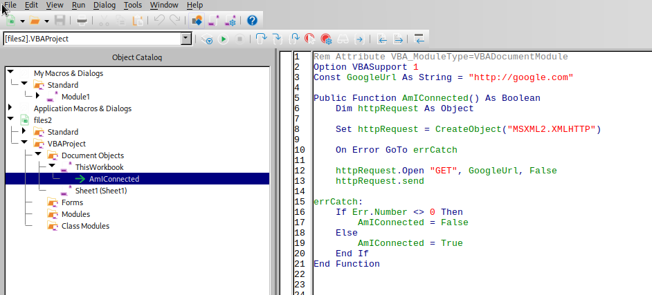

# Forensics - fe03
## Description
```
Download the file at https://s-files.bootupctf.net/files2 and find the flag.

The flag is the name of the VB function that tests internet connectivity.
```

First, checking what type of file we're dealing with:
```
└─$ file files2                                                                                                     
files2: Microsoft Excel 2007+
```

Editing the macro from within Libreoffice reveals the answer:


