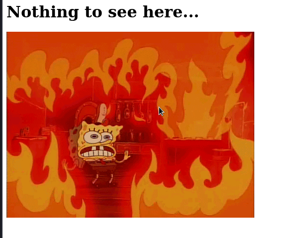

# Web - we02
## Description
```Access the website at https://2-we01.bootupctf.net/ and find the flag.```

Browsing to the site and checking the source code doesn't reveal much:


and the source code:
```
<html>
    <head>
        <title>Nothing to see here...</title>
    </head>
    <body>
        <h1>Nothing to see here...</h1>
        
    </body>
</html>
```

Next step is trying to enumerate a bit more:
```
└─$ ffuf -u https://2-we01.bootupctf.net/FUZZ -w ~/SecLists/Discovery/Web-Content/directory-list-2.3-big.txt -fc 403
...
[Status: 302, Size: 313, Words: 10, Lines: 14, Duration: 106ms]
    * FUZZ: security
...
```

From here, we find the flag at `https://2-we01.bootupctf.net/security/flag.txt`:
`Flag: verySecUReDireCToRY_1180018`
