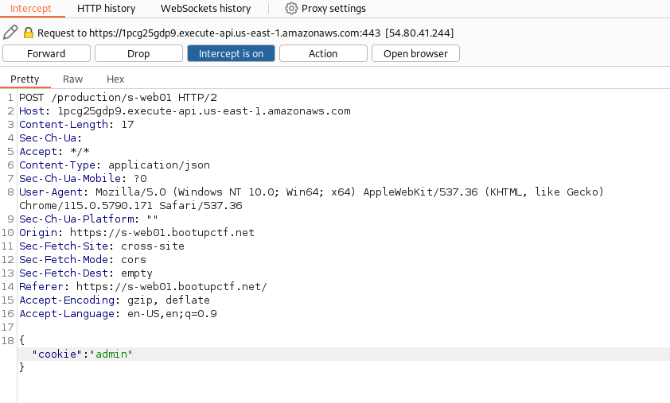

# Web - we06
## Description
```
Access the site at http://s-web01.bootupctf.net and find the flag.

```

Page shows:
```
"You are a Guest! You need to be an Admin to see the flag!"
```
And the source:
```
<html>
    <head>
        <style type="text/css">
            body {
            font-family: sans-serif;
            background-color: #F7EFD8; /* Pastel background */
            }

            h1, h2, h3, h4, h5, h6 {
            font-family: sans-serif;
            color: #543C2A; /* Dark sepia text color */
            }

            p, a {
            font-family: sans-serif;
            color: #61492C; /* Sepia text color */
            }
        </style>
        <script src="js/jquery-3.4.1.min.js"></script>
        <script src="js/js.cookie.min.js"></script>
        <script>
            $(document).ready(function() {
                var cookie = Cookies.get("role") ?? "User";
                
                $.ajax({
                    type: "POST",
                    url: 'https://1pcg25gdp9.execute-api.us-east-1.amazonaws.com/production/s-web01',
                    contentType: 'application/json',
                    data: JSON.stringify({
                        'cookie': cookie
                    }),
                    success: function(res){
                        $("#output").append(JSON.stringify(res));
                    },
                    error: function(err){
                        console.log(err);
                    }
                });
            });
        </script>
    </head>
    <body>
        <div class="container h-mt-5">
            <div class="c-well">
                <div id="output" class="h-mb-4"></div>
            </div>
        </div>
    </body>
</html>
```

So the role for the user is obtained from a POST request to 'https://1pcg25gdp9.execute-api.us-east-1.amazonaws.com/production/s-web01', with a json containing the cookie.
Proxying the requests with burp just to make it easier, and changing the cookie to `admin`:


And now we get:
```
"Welcome, Admin!
The flag is: T4k3_4_b1t3_out0f_th1sCook1e!"
```

