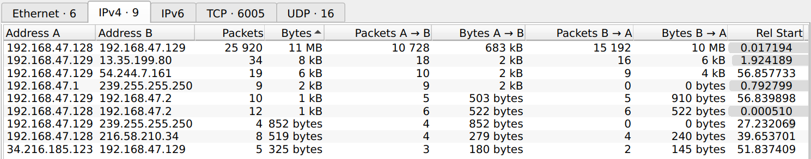

# Forensics - fx01
## Description
```
Download the file at https://1-files.bootupctf.net/fx01.zip and find a way to get the flag.
``` 

We get a pcap file with a lot of information. Started by looking at the conversations, and seems like the most chatty was between `192.168.47.128` and `192.168.47.129`.


Filtering for this 2 machines and inspecting the streams showed some interesting headers in the UDP streams, with what seemed like `jpg`and `zip` files, among others.
Another interesting aspect of this UDP stream was that it seemed to always have a small header, that increased on each packet sent from `*.129`, followed by what looked like binary data.
From here, I extraced each UDP stream as a json file, and created a short python script to go packet by packet, remove the header from the UDP payload, and reassemble the sent file:

```
import json

out = ''
#with open('4text.json','r') as f:
with open('5_new.json','r') as f:
    d= json.load(f)
    for i in d:
        block = (i["_source"]["layers"]["udp"]["udp.payload"])
        tb = block.split(":")
        new = tb[16:]
        n = ''.join(new)
        out = out + n

print(out)
```

Repeated this for each of the 5 files sent, and the last one was a `jpg` with the flag:


