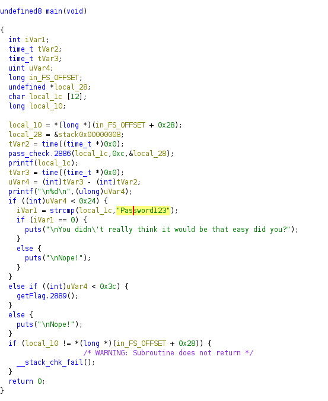

# Pwn - bm02
## Description
```
Download the files at https://3-files.bootupctf.net/bm01.zip and find a way to get the flag. Once your method works use the same process to get the real flag from the network service at 3-bm01.bootupctf.net port: 8223.
```

We get a placeholder flag.txt, and a server binary.
```
└─$ unzip bm01.zip                 
Archive:  bm01.zip
  inflating: flag.txt                
  inflating: server                  

└─$ file server 
server: ELF 64-bit LSB pie executable, x86-64, version 1 (SYSV), dynamically linked, interpreter /lib64/ld-linux-x86-64.so.2, for GNU/Linux 3.2.0, BuildID[sha1]=aa43180bfba2a72e78dd2afdbaac5b0c8f455537, not stripped

```
Quick ghidra check on the binary:


Shows that it is checking if less than 36 seconds have elapsed since the program was launched. If so, it will check for `Password123` as a fake password. Otherwise, if less than 60 seconds have passed, it will call getFlag.
So we just need to wait for 36s to get the flag:
```
Flag: waiTingPatienTlyRWe01-10
```
