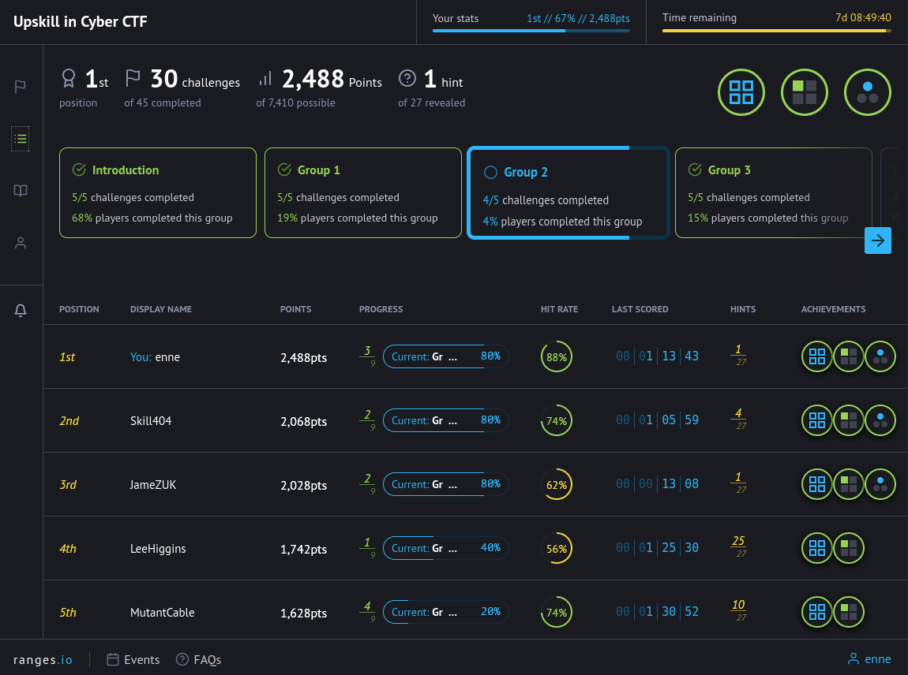

# SANS Upskill in Cyber CTF

This was a private CTF organized by SANS to close up their UK Upskill in Cyber programme.
It includes 45 challenges, divided into:
    - Intro
    - Easy
    - Medium
    - Hard
    - Extreme

We had 4h to complete as many challenges as possible before the scoring, and 7 days access to the remaining challenges.
I managed to finish 1st out of 84 people on this one, and I'm including the write-ups for each challenge here (skipping the introductory and theoretical ones)

